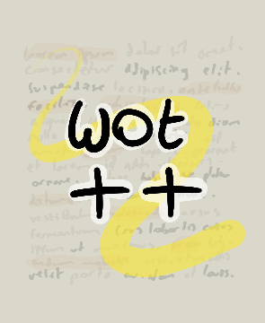

<p align=center></p>

# Wot++
Wot++ is a language for writing documents that allows you to build up your own library of abstractions
or use those made by others.

Wot++ has some interesting features like meta-programming, the ability to invoke a shell,
bit-level manipulation, recursion and conditionals.


[](./LICENSE)

[](https://github.com/Jackojc/wotpp/issues)
[](https://discord.gg/hQ7yS9dxcp)

### Getting Started & Reference
See the introduction [here](docs/introduction.md)
and see the reference [here](docs/reference.md).

### Example
```
#[ Setup some macros. ]
let \n "\n"
let \n2 "\n\n"

let #(x) "# " .. x .. \n2
let ##(x) "## " .. x .. \n2
let ###(x) "### " .. x .. \n2
let ####(x) "#### " .. x .. \n2
let #####(x) "##### " .. x .. \n2

let >(x) "> " .. x .. \n2

let *(x) " *" .. x .. "* "
let **(x) " **" .. x .. "** "

let link(name, url) " [" .. name .. "](" .. url .. ") "


#[ Our actual document... ]

#("Hello, World!")
###("A short example of wot++ code.")

>("Here's a link: " .. link("Discord", "https://discord.gg/hQ7yS9dxcp"))

"Lorem ipsum dolor sit amet, consectetur adipiscing elit. Duis dictum volutpat lacus,
sollicitudin pellentesque tellus viverra non. Phasellus est lorem, porta ut metus vitae,
ultricies semper lacus. Vestibulum ante ipsum primis in faucibus orci luctus et ultrices
posuere cubilia curae; Suspendisse sollicitudin egestas tristique. Nullam condimentum
vehicula mi, eu hendrerit libero condimentum posuere. Suspendisse fringilla lacus nulla,
ut finibus nisi vulputate consequat. Vestibulum efficitur ultricies dolor, a iaculis diam
interdum ut. Nunc rhoncus, lorem mattis porttitor luctus, ligula tellus vulputate arcu,
vitae blandit nisl ipsum ac augue. Nulla a ex eget risus tristique consequat nec ac lacus.
Phasellus blandit massa non iaculis finibus. Quisque suscipit pharetra iaculis. Maecenas
ac turpis est. Aenean id est vitae mi facilisis luctus ut a nulla. Mauris facilisis, sem
eu rhoncus iaculis, justo erat efficitur purus, et dictum mi lorem sit amet neque."
```

### Prerequisites
- A C++17 compliant compiler. (GCC & Clang work)
- Meson & Ninja
- libasan (optional, required for sanitizer support)
- libreadline (optional, required for REPL)
- Python3 (optional, required for running test suite)

### Build & Run
```
$ meson build
$ ninja -C build
```

You can specify the compiler and linker to use through environment variables:
```
$ CXX=clang++ CXX_LD=lld meson build
```

Supported flags:
```
-Dnative=true               # enable host machine specific optimisations
-Dsanitizers=true           # enable sanitizers (undefined,address)
-Dprofile=true              # enable profiling support (uftrace etc.)
-Ddisable_run=false         # disable the `run` intrinsic for security purposes
-Dbuildtype=debugoptimised  # enable symbols
```
> List of built-in Meson options can be found [here](https://mesonbuild.com/Builtin-options.html).

An example:
```
$ meson -Dsanitizers=true -Dprofile=true build
```

If you already have configured a build directory, you'll need to add `--reconfigure`:
```
$ meson --reconfigure -Dsanitizers=true -Dprofile=true build
```

To run the tests:
```
$ ninja -C build test
```

### Installation
```
$ cd build/
$ meson install  # requires root perms (sudo/su/doas)
```

If you want to specify a custom install directory:
```
$ cd build/
$ meson configure --prefix=/usr/local/
$ DESTDIR=/ meson install
```

### Cool Projects
[wot-goodies](https://github.com/jlagarespo/wot-goodies)
> A collection of interesting snippets of Wot++ code.

[waas](https://github.com/iCiaran/waas)
> A site where you can upload wot++ files and download the compiled output.

### Acknowledgements
Thanks, in no particular order:
- [Noxabellus](https://github.com/noxabellus)
- [DeKrain](https://github.com/dekrain)
- [AnonymousPlayer](https://github.com/Anonymus-Player)
- [Ciarán](https://github.com/iCiaran)
- [Binkiklou](https://github.com/binkiklou)
- [Strexicious](https://github.com/strexicious/)
- [Eremiell](https://github.com/Eremiell)
- [Violetas](https://github.com/violetastcs)
- [Moonsheep](https://github.com/jlagarespo)
- [Samuel](https://github.com/swr06/)

And everyone else who I may have failed to mention over the years.

### History
See the timeline [here](docs/history/README.md).

### License
This project uses the MPL-2.0 license. (check [LICENSE.md](LICENSE.md))

### Progress & Discussion
You can join the discord server in order to follow progress and/or contribute to discussion of the project. (https://discord.gg/hQ7yS9dxcp)

